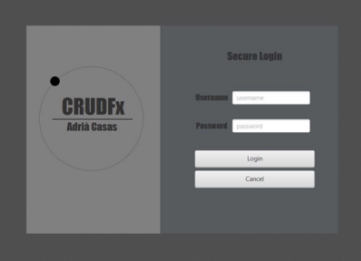
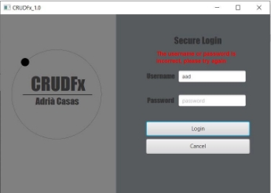
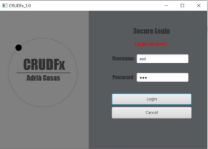
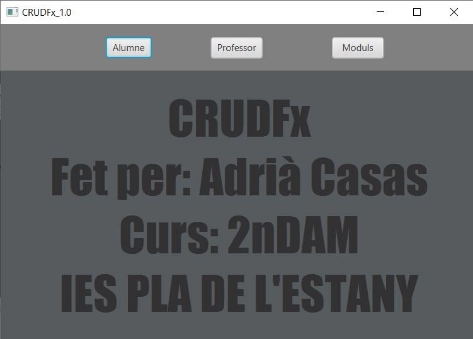
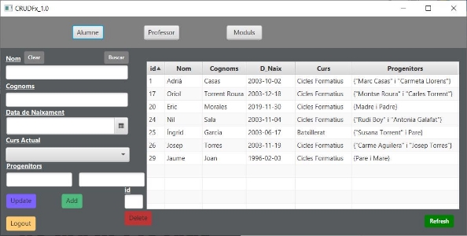
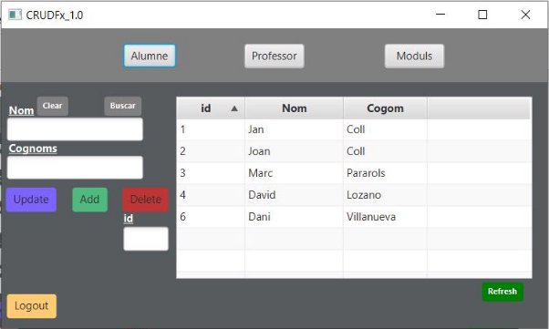
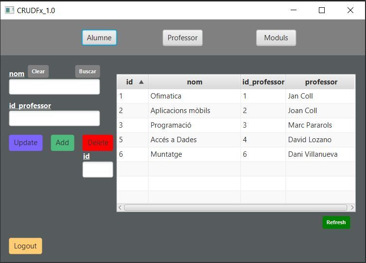

Instruccions i funcionalitats CRUD\_Fx

**Buttons:**

**Professor:** Crida mètode per cambiar al CRUD de Professors.

**Alumne:** Crida mètode per cambiar al CRUD de Alumnes.

**Mòduls:** Crida mètode per cambiar al CRUD de Mòduls.

**Clear:** Crida un mètode per poder borrar tots els elements dels TextFields, DatePicker i ChoiceBox.

**Buscar:** Cridar mètode per introduir una id i et carrega els valors de la BD.

**Update:** Crida mètode per poder fer modificacions dels registres.

**Add:** Crida mètode per poder fer inserts de registres a la BD.

**Delete:** Crida mètode per borrar de la BD un registre per la seva id.

**Logout:** Crida mètode per carregar la pàgina de login.

**Refresh:** Crida un mètode que fa clear de un listView busca tots 

els registres i els carrega a la table.  
Al iniciar l’aplicació per defecte ens surt la primera pantalla és de login,

per iniciar haurem d’introduir el username i el password.

Si falten dades a introduïr, ens donarà un avis desde un label que

el password o l’username són incorrectes.

Si les dades que introduïm son incorrectes ens dirà que no s’ha fet el login.

Si el username o el password són correctes, carrega la següent pàgina:

A partir d'aquí podrás escollir si vols fer CRUD de alumnes,professor o mòduls. 

CRUD de Alumnes:

CRUD de Professors:

CRUD de Moduls:

